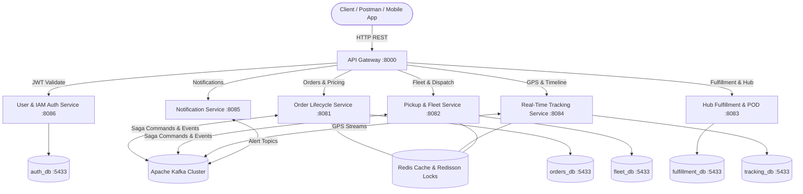

# 🚚 Enterprise Smart Logistics & Express Delivery Microservices Platform

[](https://spring.io/projects/spring-boot)
[](https://spring.io/projects/spring-cloud)
[](https://kafka.apache.org/)
[](https://redis.io/)
[](https://www.postgresql.org/)
[]()

Production-grade, event-driven Logistics & Parcel Delivery Microservices ecosystem built with **Spring Boot 3.4**, **Apache Kafka**, **Redis Enterprise Caching**, **PostgreSQL**, and **Docker**.

---

## 🏛️ System Architecture Topology



---

## 🎯 Key Design Patterns & Engineering Highlights

### 1. 🔄 Saga Pattern (Orchestration with Compensation)
- **Problem**: In microservices, each service has its own database (Database-per-Service). Traditional 2PC (Two-Phase Commit) causes heavy database locking and poor scalability.
- **Solution**: The **Saga Pattern** breaks down distributed transactions into a sequence of local transactions:
  1. **Step 1 (Order Service)**: Creates order in `PENDING` state and publishes `FleetPickupCommand` via Kafka.
  2. **Step 2 (Pickup Fleet Service)**: Locates and reserves the nearest courier driver. If no drivers are available, emits `FleetPickupResultEvent(success=false)`.
  3. **Step 3 (Payment Service)**: Reserves customer funds / validates COD amount.
  4. **Compensating Transactions (Rollback)**: If Step 3 or Step 2 fails, the Orchestrator executes backward rollback commands: releases the reserved driver, marks order as `CANCELLED`, and emits cancellation alerts.

### 2. 📬 Transactional Outbox Pattern
- Guarantees **At-Least-Once Delivery** to Kafka.
- Emits events and changes local database records within the exact same atomic database transaction. A background scheduler (`OutboxEventPublisher`) relays pending records from `order_outbox` to Kafka.

### 3. 🛡️ Redis Memory Protection & High Performance Caching
- **LRU Auto-Eviction**: Configured with `--maxmemory 512mb --maxmemory-policy allkeys-lru`.
- **Automatic TTL**: 7-day TTL for tracking snapshots, 24-hour TTL for driver dispatch states.
- **Redisson Distributed Locks**: Prevents race conditions during concurrent order status transitions.

### 4. 🔐 Zero-Trust Resource Server Security (JWT)
- Centralized IAM service (`user-auth-service`) signs HMAC-SHA256 JWT tokens.
- Every downstream service acts as an independent **Resource Server** using custom `JwtAuthenticationFilter` and stateless `SecurityFilterChain`.

### 5. 🧩 Gang of Four (GoF) Design Patterns & SOLID Principles

```
                                  [ Client / OrderService ]
                                             │
                       ┌─────────────────────┴─────────────────────┐
                       ▼                                           ▼
             [ Singleton Pattern ]                        [ Factory Pattern ]
          LogisticsConfigRegistry                      PricingStrategyFactory
       (Bill Pugh Lazy Initialization)               (Open/Closed Dynamic Lookup)
                       │                                           │
                       └─────────────────────┬─────────────────────┘
                                             ▼
                                   [ Strategy Pattern ]
                                 ShippingPricingStrategy
                                             │
         ┌───────────────────┬───────────────┴───────────────┬───────────────────┐
         ▼                   ▼                               ▼                   ▼
[ StandardStrategy ]  [ ExpressStrategy ]          [ HeavyFreightStrategy ] [ ColdChainStrategy ]
 (24-48h Road Van)    (4-8h Priority Air)           (Pallet / Tailgate)     (Temp-Controlled)
```

#### A. 🎯 SOLID Principles in Action
1. **S - Single Responsibility Principle (SRP)**:
   - `PricingContext`: Only encapsulates calculation input parameters.
   - Each Strategy (e.g. `ExpressShippingPricingStrategy`): Only handles priority formula math.
   - `PricingCalculationService`: Coordinates request flow and maps DTOs.
2. **O - Open/Closed Principle (OCP)**:
   - To add a new tier like `DroneDeliveryPricingStrategy` or `InternationalPricingStrategy`, you only implement `ShippingPricingStrategy`.
   - `PricingStrategyFactory` auto-registers all beans implementing `ShippingPricingStrategy` without modifying existing classes.
3. **L - Liskov Substitution Principle (LSP)**:
   - Any `ShippingPricingStrategy` implementation can replace another without altering caller correctness.
4. **I - Interface Segregation Principle (ISP)**:
   - `ShippingPricingStrategy` and `NotificationChannelStrategy` expose strictly necessary methods without bloat.
5. **D - Dependency Inversion Principle (DIP)**:
   - High-level services (`PricingCalculationService`, `NotificationDispatcherService`) depend on abstract strategy interfaces, injected via Spring DI and Factories.

#### B. 🏭 Factory Pattern
- **`PricingStrategyFactory`** (`order-service`): Resolves the appropriate pricing strategy by `DeliveryType` or dynamically evaluates shipment weight/flags.
- **`NotificationStrategyFactory`** (`notification-service`): Resolves the multi-channel notification sender (`SMS`, `EMAIL`, `ZALO_ZNS`, `PUSH`).

#### C. 👑 Singleton Pattern
- **`LogisticsConfigRegistry`** (`order-service`): Implements the **Bill Pugh Singleton** (Initialization-on-Demand Holder Idiom) ensuring 100% thread-safe, lazy-initialized global access to system fee parameters, dynamic fuel multipliers, and region metadata without synchronization bottlenecks.

#### D. ♟️ Strategy Pattern
- **Dynamic Logistics Pricing**:
  - `StandardShippingPricingStrategy`: Standard road courier rate ($25,000 VND base + distance + weight tiers).
  - `ExpressShippingPricingStrategy`: Same-day 4-8 hour priority with expedited transit multiplier.
  - `HeavyFreightPricingStrategy`: Bulk cargo with tailgate truck & forklift handling surcharges.
  - `ColdChainPricingStrategy`: Refrigerated container thermal management & dry-ice surcharge.
- **Multi-Channel Notification Dispatcher**:
  - `SmsNotificationStrategy`, `EmailNotificationStrategy`, `ZaloZnsNotificationStrategy`, `PushNotificationStrategy`.


---

## 📦 Microservices Port & Resource Allocation

| Microservice | Internal Port | External Port | Database | Primary Responsibility |
| :--- | :--- | :--- | :--- | :--- |
| **`api-gateway`** | `8000` | `8000` | — | Central Ingress, Routing & Rate Limiting |
| **`service-registry`** | `8761` | `8761` | — | Netflix Eureka Service Discovery |
| **`user-auth-service`** | `8086` | `8086` | `auth_db` | JWT Authentication, BCrypt & RBAC |
| **`order-service`** | `8081` | `8081` | `orders_db` | Order Lifecycle, Dynamic Pricing & Saga |
| **`pickup-fleet-service`** | `8082` | `8082` | `fleet_db` | Courier Fleet & Dispatching |
| **`fulfillment-service`** | `8083` | `8083` | `fulfillment_db` | Hub Sorting, Cross-Docking & Proof-of-Delivery |
| **`tracking-service`** | `8084` | `8084` | `tracking_db` | Real-time GPS Spatial Index & Milestones |
| **`notification-service`**| `8085` | `8085` | `notification_db` | Multi-channel SMS/Email Alerts |
| **`PostgreSQL`** | `5432` | `5433` | *All 5 DBs* | Relational Multi-Database Storage |
| **`Kafka`** | `9092` | `9092` | — | Event Streaming Backbone |
| **`Redis`** | `6379` | `6379` | — | Distributed Cache & Geo Spatial Index |

---

## 🚀 Quick Start Guide

### Prerequisites
- **JDK 17 or JDK 21**
- **Apache Maven 3.9+**
- **Docker Desktop & Docker Compose**

### Step 1: Start Infrastructure Containers
Start Kafka, Zookeeper, Redis, and PostgreSQL with a single command:
```bash
docker-compose up -d postgres-db redis zookeeper kafka
```

### Step 2: Build the Parent Maven Project
```bash
cd microservices
mvn clean install -DskipTests
```

### Step 3: Run Services in Sequence (via IDE or Terminal)
1. `service-registry` (`ServiceRegistryApplication`)
2. `api-gateway` (`ApiGatewayApplication`)
3. `user-auth-service` (`UserAuthServiceApplication`)
4. `order-service` (`OrderServiceApplication`)
5. `pickup-fleet-service` (`PickupFleetServiceApplication`)
6. `fulfillment-service` (`FulfillmentServiceApplication`)
7. `tracking-service` (`TrackingServiceApplication`)
8. `notification-service` (`NotificationServiceApplication`)

---

## 🧪 Testing with Postman
1. Import `postman_collection.json` and `postman_environment.json` into Postman.
2. Run **IAM Authentication > Login Customer / Driver / Admin**. The collection automatically stores the Bearer JWT token in your environment.
3. Execute **Order Service > Create Express Delivery Order** and observe the real-time Saga execution across console logs.
4. Run **Tracking Service > Query Public Timeline by Tracking Number** to inspect the live status!
