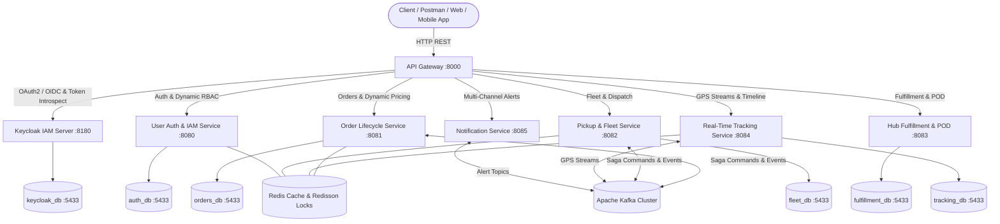

# 🚚 Enterprise Smart Logistics & Express Delivery Microservices Platform

[](https://spring.io/projects/spring-boot)
[](https://spring.io/projects/spring-cloud)
[](https://www.keycloak.org/)
[](https://www.liquibase.org/)
[](https://kafka.apache.org/)
[](https://redis.io/)
[](https://www.postgresql.org/)
[]()

Enterprise-grade, distributed, event-driven Logistics & Parcel Delivery Microservices ecosystem built with **Spring Boot 3.4**, **Keycloak IAM (OpenID Connect / OAuth2)**, **Liquibase Database Migrations**, **Apache Kafka**, **Redis Enterprise Caching**, **PostgreSQL**, and **Docker**.

---

## 🏛️ System Architecture Topology



---

## 🔑 Identity & Access Management with Keycloak

The platform integrates **Keycloak 24.0.2** as the centralized Identity and Access Management (IAM) provider, supporting OpenID Connect (OIDC) and OAuth 2.0 protocols.

### Keycloak Specifications & Endpoints
- **Keycloak Console URL**: `http://localhost:8180`
- **Default Master Admin**: `admin` / `admin`
- **Logistics Realm**: `logistics-realm`
- **Issuer URI**: `http://localhost:8180/realms/logistics-realm`
- **JWKS Endpoint**: `http://localhost:8180/realms/logistics-realm/protocol/openid-connect/certs`
- **Token Endpoint**: `http://localhost:8180/realms/logistics-realm/protocol/openid-connect/token`
- **Client ID**: `logistics-api-gateway`
- **Client Secret**: `logistics-gateway-secret-2024-enterprise-jwt`
- **Realm Auto-Import**: Mounted automatically via Docker volume from `./infrastructure/keycloak/logistics-realm.json`.

### Dual Authentication & Resilience Strategy:
1. **Keycloak Direct Grant & SSO**: Primary OAuth2 token issuance through Keycloak.
2. **Hybrid / Fallback Local Auth**: If Keycloak is disabled or during independent testing, `user-auth-service` seamlessly handles local JWT authentication (HMAC-SHA256) with BCrypt password hashing and Redis token blacklisting.

---

## 🗄️ Database Migrations with Liquibase

All relational database schemas and initial data seeding are managed declaratively using **Liquibase**.

### Liquibase Configuration in `application.yml`
```yaml
spring:
  liquibase:
    change-log: classpath:db/changelog/db.changelog-master.xml
    enabled: true
```

### Changelog Structure:
- **Master Changelog**: `src/main/resources/db/changelog/db.changelog-master.xml`
- **Schema Changeset (`001-create-schema.xml`)** *(author: `Vanlinh00`)*:
  - Creates tables with `preConditions` (`onFail="MARK_RAN"`):
    - `permissions` (id, code, description, module)
    - `roles` (id, code, name, description)
    - `role_permissions` (role_id, permission_id join table)
    - `users` (id, username, email, password_hash, full_name, phone, role, active, mfa_enabled)
    - `courier_profiles` (id, user_id, citizen_id, vehicle_type, license_plate, max_capacity_kg)
    - `merchant_profiles` (id, user_id, shop_name, tax_code, warehouse_address, bank_account)
    - `auth_audit_logs` (id, username, event_type, details, ip_address, created_at)
- **Data Load Changeset (`002-load-initial-data.xml`)** *(author: `Vanlinh00`)*:
  - Seeds initial records via `<loadData>` from CSV files:
    - `db/data/permissions.csv`
    - `db/data/roles.csv`
    - `db/data/role_permissions.csv`
    - `db/data/users.csv`

---

## 👥 Seeded Test Accounts & Default Passwords

All pre-seeded test accounts use the standardized password: **`Test123456@`**

| Username | Email | Role | Default Password | Permissions Overview |
| :--- | :--- | :--- | :--- | :--- |
| **`admin`** | `admin@logistics.com` | `ROLE_ADMIN` | `Test123456@` | Full system access (`users:*`, `orders:*`, `fleet:*`, `system:manage`) |
| **`courier01`** | `courier1@logistics.com` | `ROLE_COURIER` | `Test123456@` | Delivery execution (`orders:pod:upload`, `fleet:status:toggle`, `tracking:push:location`) |
| **`merchant01`** | `merchant1@logistics.com` | `ROLE_MERCHANT` | `Test123456@` | Merchant store access (`orders:create`, `merchant:profile:manage`, `inventory:sync`) |
| **`dispatcher01`**| `dispatcher1@logistics.com`| `ROLE_DISPATCHER`| `Test123456@` | Fleet operations (`orders:assign`, `fleet:route:optimize`, `fleet:read`) |
| **`user001`** | `test1@gmail.com` | `ROLE_CUSTOMER` | `Test123456@` | Customer portal (`orders:read:self`, `orders:create`, `tracking:read`) |
| **`user002`** | `test2@gmail.com` | `ROLE_CUSTOMER` | `Test123456@` | Customer portal (`orders:read:self`, `orders:create`, `tracking:read`) |

---

## 🌐 Standardized Message & Error Code System (`MessageCode`)

All API responses follow the standardized enterprise response wrapper and `i.xx.fw.*` message code contract:

### Code Definition (`MessageCode.java`)
```java
@Getter
@RequiredArgsConstructor
public enum MessageCode {
    // 2xx Success Codes
    SUCCESS("i.xx.fw.200"),
    CREATED("i.xx.fw.201"),

    // 4xx Client Error Codes
    BAD_REQUEST("i.xx.fw.400"),
    UNAUTHORIZED("i.xx.fw.401"),
    FORBIDDEN("i.xx.fw.403"),
    NOT_FOUND("i.xx.fw.404"),
    GROUP_NOT_FOUND("i.xx.fw.405"),
    USER_NOT_FOUND("i.xx.fw.406"),
    ACCOUNT_INACTIVE("i.xx.fw.407"),
    USER_ALREADY_EXISTS("i.xx.fw.408"),
    CONFLICT("i.xx.fw.409"),
    TOKEN_INVALID("i.xx.fw.410"),
    VALIDATION_FAILED("i.xx.fw.411"),
    PASSWORD_MISMATCH("i.xx.fw.412"),
    MFA_INVALID("i.xx.fw.413"),
    MFA_REQUIRED("i.xx.fw.414"),
    ROLE_NOT_FOUND("i.xx.fw.415"),
    COURIER_PROFILE_NOT_FOUND("i.xx.fw.416"),
    MERCHANT_PROFILE_NOT_FOUND("i.xx.fw.417"),

    // 5xx Server Error Codes
    INTERNAL_SERVER_ERROR("i.xx.fw.500");

    private final String code;
}
```

### Standard Response Format (`ApiResponse<T>`)
```json
{
  "success": true,
  "code": "i.xx.fw.200",
  "message": "Success!",
  "data": { ... },
  "details": [],
  "timestamp": "2026-08-25T10:15:00"
}
```

---

## 🎯 Key Design Patterns & Engineering Highlights

### 1. 🔄 Saga Pattern (Orchestration with Compensation)
- Manages distributed workflows across microservices:
  1. **Step 1 (Order Service)**: Creates order in `PENDING` state and publishes `FleetPickupCommand` via Kafka.
  2. **Step 2 (Pickup Fleet Service)**: Locates and reserves the nearest courier driver. If no drivers are available, emits `FleetPickupResultEvent(success=false)`.
  3. **Step 3 (Payment Service)**: Reserves customer funds or validates COD amount.
  4. **Compensating Transactions (Rollback)**: If any step fails, the Orchestrator executes backward rollback commands: releases the reserved driver, marks the order as `CANCELLED`, and emits alert notifications.

### 2. 📬 Transactional Outbox Pattern
- Guarantees **At-Least-Once Delivery** to Kafka.
- Emits events and changes local database records within the exact same atomic database transaction. A background scheduler (`OutboxEventPublisher`) relays pending records from `order_outbox` to Kafka.

### 3. 🛡️ Redis Memory Protection & High Performance Caching
- **LRU Auto-Eviction**: Configured with `--maxmemory 512mb --maxmemory-policy allkeys-lru`.
- **Automatic TTL**: 7-day TTL for tracking snapshots, 24-hour TTL for driver dispatch states.
- **Redisson Distributed Locks**: Prevents race conditions during concurrent order status transitions.

### 4. 🧩 GoF Design Patterns & Dynamic RBAC
- **Dynamic Database-Driven RBAC**: Permissions are resolved dynamically from PostgreSQL join tables (`roles`, `permissions`, `role_permissions`) with zero hardcoded switch-case fallbacks.
- **Strategy Pattern**: Pluggable pricing algorithms (`StandardShippingPricingStrategy`, `ExpressShippingPricingStrategy`, `HeavyFreightPricingStrategy`, `ColdChainPricingStrategy`).
- **Factory Pattern**: Dynamic strategy lookups via `PricingStrategyFactory` and `NotificationStrategyFactory`.
- **Singleton Pattern**: `LogisticsConfigRegistry` implemented with Bill Pugh Initialization-on-Demand Holder Idiom for zero-overhead, thread-safe configuration caching.

---

## 📦 Microservices Port Allocation

| Microservice | Internal Port | External Port | Database | Primary Responsibility |
| :--- | :--- | :--- | :--- | :--- |
| **`api-gateway`** | `8000` | `8000` | — | Central Ingress, Routing & Rate Limiting |
| **`service-registry`** | `8761` | `8761` | — | Netflix Eureka Service Discovery |
| **`keycloak`** | `8080` | `8180` | `keycloak_db` | Centralized IAM, OpenID Connect & OAuth2 Provider |
| **`user-auth-service`** | `8080 / 8086` | `8080 / 8086` | `auth_db` | JWT Authentication, BCrypt, 2FA & Dynamic RBAC |
| **`order-service`** | `8081` | `8081` | `orders_db` | Order Lifecycle, Dynamic Pricing & Saga |
| **`pickup-fleet-service`** | `8082` | `8082` | `fleet_db` | Courier Fleet & Dispatching |
| **`fulfillment-service`** | `8083` | `8083` | `fulfillment_db` | Hub Sorting, Cross-Docking & Proof-of-Delivery |
| **`tracking-service`** | `8084` | `8084` | `tracking_db` | Real-time GPS Spatial Index & Milestones |
| **`notification-service`**| `8085` | `8085` | `notification_db` | Multi-channel SMS/Email Alerts |
| **`PostgreSQL`** | `5432` | `5433` | *All 6 DBs* | Relational Multi-Database Storage |
| **`Kafka`** | `9092` | `9092` | — | Event Streaming Backbone |
| **`Redis`** | `6379` | `6379` | — | Distributed Cache & Geo Spatial Index |

---

## 🚀 Quick Start Guide

### Prerequisites
- **JDK 17 or JDK 21**
- **Apache Maven 3.9+**
- **Docker Desktop & Docker Compose**

### Step 1: Start Infrastructure & IAM Containers
```bash
docker-compose up -d postgres keycloak redis zookeeper kafka
```

### Step 2: Build All Microservices
```bash
cd microservices
mvn clean install -DskipTests
```

### Step 3: Start Services in Recommended Sequence
1. `service-registry` (`ServiceRegistryApplication`)
2. `api-gateway` (`ApiGatewayApplication`)
3. `user-auth-service` (`UserAuthServiceApplication`)
4. `order-service` (`OrderServiceApplication`)
5. `pickup-fleet-service` (`PickupFleetServiceApplication`)
6. `fulfillment-service` (`FulfillmentServiceApplication`)
7. `tracking-service` (`TrackingServiceApplication`)
8. `notification-service` (`NotificationServiceApplication`)

---

## 🧪 Postman API Testing

1. Import `user-auth-service.postman_collection.json` (or `postman_collection.json`) into Postman.
2. Run **`1.1. Login as Admin`** (password: `Test123456@`). The access token is automatically saved into collection variables (`{{jwt_token}}`).
3. Test **`1.7. Validate Token`** or **`2.1. Get Current User (/me)`** to verify the bearer token, role claims, and permissions.
4. Test downstream order placement and tracking endpoints via the API Gateway (`http://localhost:8000`).
